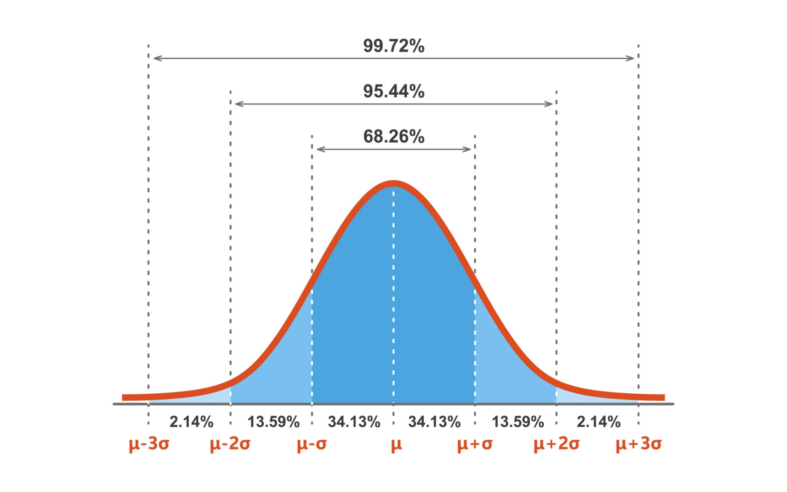

# 🎰 Simulador Primitiva IA Pro v2.0

Este software avanzado utiliza **Machine Learning** y **filtros de exclusión estadística** para generar combinaciones de lotería basadas en el histórico real (1986-2026).

## 🚀 Nuevas Funciones de Inteligencia

### 1. El Algoritmo de Clustering (K-Means)
La IA divide los 49 números en 6 "familias" según su frecuencia. El programa elige un representante de cada familia, garantizando que tu apuesta tenga números "Calientes" (frecuentes) y "Fríos" (que están por salir), evitando jugadas descompensadas.

### 2. La Regla de la Suma (Σ)
Estadísticamente, el **75% de los sorteos ganadores** tienen una suma total de sus 6 números entre **130 y 210**. El simulador descarta automáticamente cualquier combinación que se salga de este rango de probabilidad.

### ⚖️ El Misterio de la Suma (Σ)

¿Te has fijado que al lado de cada jugada pone algo como `Σ:142`? Esa letra rara es el símbolo de la **Suma**. 

Imagina que cada número es una gominola que pesa lo que dice su número. Si eliges el 1, 2, 3, 4 y 5, tu mochila solo pesa **15 gramos**. ¡Es muy ligera! Si eliges el 46, 47, 48, 49 y 50, tu mochila pesa **230 gramos**. ¡Es pesadísima!

El robot ha estudiado miles de sorteos y ha descubierto un secreto: **¡A la suerte no le gustan las mochilas ni muy ligeras ni muy pesadas!** Casi siempre, las mochilas ganadoras pesan entre **95 y 160 gramos**.

  
   
  <em>La "Montaña de la Suerte": Casi todos los premios caen en el centro (la parte alta).</em>

### 🕵️‍♂️ ¿Qué significan las etiquetas (3P/2I)?

Al final de cada jugada verás un código extraño como `3P/2I`. ¡No es un mensaje secreto! Es la forma que tiene el robot de decirte que la combinación está **equilibrada**.

* **P = PARES**: Números como el 2, 14, 26, 40...
* **I = IMPARES**: Números como el 1, 15, 27, 49...

**¿Por qué es importante?**
Si miras todos los sorteos de la historia, verás que **casi nunca** salen todos los números pares o todos impares. ¡Es muy raro! Lo más común es que haya una mezcla. 

El robot usa este filtro para que tu apuesta sea realista:
- **3P/2I**: Significa 3 pares y 2 impares.
- **2P/3I**: Significa 2 pares y 3 impares.

Si el robot genera una jugada con "demasiados" pares o impares, ¡la borra y hace una nueva hasta que quede perfecta!

**¿Por qué el robot hace esto?**
Porque hay miles de formas de sumar un número mediano (como 130), pero solo hay una forma de sumar un número muy pequeño. Al quedarnos en el centro de la montaña, ¡tenemos muchas más oportunidades de acertar!

### 3. Filtro de Paridad (NUEVO)
Es extremadamente raro (menos del 2% de los casos) que una combinación ganadora esté formada solo por números pares o solo por impares. 
- **Optimización**: El simulador ahora obliga a que cada apuesta tenga una mezcla equilibrada (ej. 3 pares y 3 impares, o 4 y 2). Esto elimina miles de combinaciones "feas" que casi nunca salen en el bombo real.

## 🛠️ Instalación Rápida
1. Instala Python (marca "Add to PATH").
2. Pon `super_creador.py` y `historico_limpio.csv` en la misma carpeta.
3. Ejecuta el script. Se instalarán automáticamente las librerías necesarias (`pandas`, `scikit-learn`, `openpyxl`).

## 📁 Uso
- Introduce la cantidad de apuestas.
- El sistema te mostrará la combinación, el Reintegro (R), la Suma (Σ) y la distribución de Pares/Impares (P/I).